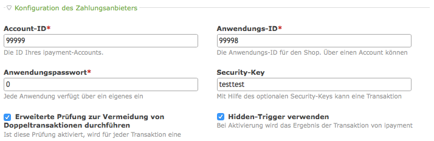

Isotope _ipayment_
================

Diese Contao-Erweiterung ergänzt den Webshop Isotope um die Zahlungsart
_ipayment_ von 1&1.

Die folgenden Features der _ipayment_ Spezifikation Version 1.2 sind
implementiert:

*   Unterstützt den normalen CGI-Modus.
*   Unterstützt den Transaktionstyp: Sofortige Buchung einer Zahlung:
    Autorisieren und abbuchen (auth).
*   Unterstützt die Zahlungsart per Kreditkarte.
*   Erlaubt die Verwendung eines Hidden-Triggers zur Zahlungsbestätigung, auch
    wenn der Kunde nach dem Bezahlen nicht zurück zum Shop geht.
*   Erlaubt die Verwendung des Security-Keys zur Absicherung des
    Zahlungsvorgangs gegen Betrugsversuch.
*   Erlaubt die Durchführung der erweiterte Prüfung zur Vermeidung von
    Doppeltransaktionen.

Weiterführende Dokumentation:

*   https://ipayment.de
*   https://ipayment.de/technik/referenzen.php

Verwendung
----------

Im Backend unter _Shop-Konfiguration_ und _Zahlungsarten_ eine neue Zahlungsart
hinzufügen. Die _Account-ID_, _Anwendungs-ID_ und das _Anwendungspasswort_
müssen angegeben werden, damit _ipayment_ die Zahlungen dem richtigen Konto
zuordnen kann. Die anderen Angaben sind optional und können deaktiviert oder
leer gelassen werden.

Die Angabe des Security-Keys ist empfehlenswert, um die Zahlungen gegen Betrug
besser zu schützen. Mit Hilfe des Security-Keys wird für die übertragenen
Zahlungsinformationen ein Hashcode gebildet, den _ipayment_ beim Empfang
verifiziert. Stimmt der Hashcode der empfangenen Zahlungsinformationen nicht,
lehnt _ipayment_ die Zahlung ab.

Um doppelte Transaktionen zu vermeiden sollte die erweitere Prüfung dazu
aktiviert werden. Eine doppelte Transaktion kann zum Beispiel entstehen, wenn
der Käufer mehrfach den Link zum Bezahlen anklickt.

Der Hidden-Trigger stellt sicher, dass die Zahlung vom Shop auch dann
registriert wird, wenn der Käufer nicht von _ipayment_ zurück zum Shop gelangt.
Dies kann zum Beispiel geschehen, wenn der Käufer nach dem Bezahlen nicht den
Zurück-zum-Shop-Link anklickt. Diese Option sollte auch aktiviert sein.

Wenn Sie die Weiterleitungsseite zu _ipayment_ anpassen wollen, können sie dafür
das Template `iso_payment_ipayment` ändern. Der Hinweistext kann durch
überschreiben der Übersetzung
`$GLOBALS['TL_LANG']['MSC']['ipayment_redirect_description']` geändert werden.
Der Buttontext durch überschreiben von
`$GLOBALS['TL_LANG']['MSC']['ipayment_submit_label']`.
